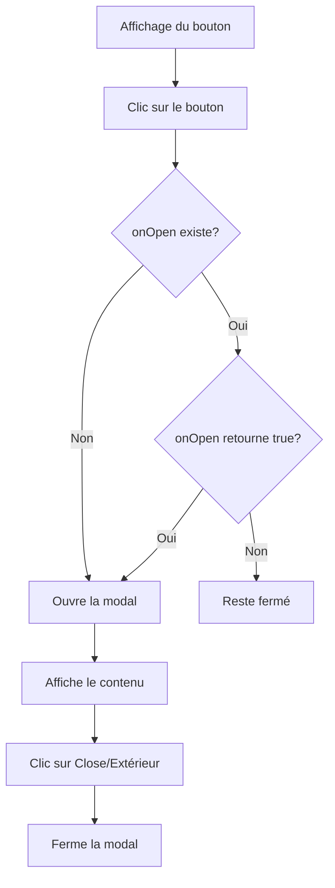

# React Modal Component

## Description
Un composant modal simple et réutilisable pour React, basé sur React Portal et Material UI.

## Installation
```bash
npm install react-modal-component
```

## Dépendances requises
| Dépendance | Version recommandée |
|------------|---------------------|
| React      | ≥ 16.8.0            |
| ReactDOM   | ≥ 16.8.0            |
| Material UI| ≥ 4.0.0             |

## Utilisation
Le composant `PortalExample` vous permet d'afficher une fenêtre modale dans votre application React.

### Import du composant
```jsx
import PortalExample from 'react-modal-component';
import './modal.css'; // Assurez-vous d'importer les styles
```

### Exemple de base
```jsx
<PortalExample 
  nameButton="Voir détails" 
  texteModal="Voici les détails du produit."
/>
```

## Props

### Props principales

| Prop | Type | Obligatoire | Description |
|------|------|-------------|-------------|
| nameButton | String | Oui | Texte affiché sur le bouton d'ouverture |
| texteModal | Node | Oui | Contenu affiché dans la modal |
| onOpen | Function | Non | Fonction exécutée avant l'ouverture |

### Détails des props

#### `nameButton` (obligatoire)
- **Type**: String
- **Description**: Texte qui sera affiché sur le bouton d'ouverture de la modal
- **Exemples**: 
  - "Ouvrir"
  - "Voir détails"
  - "Informations"

#### `texteModal` (obligatoire)
- **Type**: Node (String, JSX, ou éléments React)
- **Description**: Contenu qui sera affiché à l'intérieur de la modal
- **Possibilités**:
  - Texte simple: `"Votre demande a été enregistrée"`
  - Éléments JSX: 
    ```jsx
    <div>
      <h2>Titre</h2>
      <p>Description</p>
      
    </div>
    ```
  - Composants React: `<UserForm />`

#### `onOpen` (optionnel)
- **Type**: Function
- **Description**: Fonction exécutée avant l'ouverture de la modal
- **Retour**:
  - `true`: la modal s'ouvre
  - `false`: la modal reste fermée
- **Cas d'utilisation**:
  ```jsx
  <PortalExample 
    nameButton="Soumettre" 
    texteModal={<ConfirmationMessage />}
    onOpen={() => {
      if (isFormValid()) {
        return true;
      } else {
        alert("Veuillez remplir tous les champs obligatoires");
        return false;
      }
    }}
  />
  ```

## Fonctionnement



## Styles
Le composant nécessite un fichier CSS externe (`modal.css`) qui doit définir:

| Classe CSS | Rôle | Propriétés recommandées |
|------------|------|-------------------------|
| .modal-overlay | Fond semi-transparent | `position: fixed`, `background-color: rgba(0,0,0,0.5)` |
| .modal | Boîte modale | `background: white`, `border-radius: 8px`, `padding: 20px` |

### Exemple de CSS
```css
.modal-overlay {
  position: fixed;
  top: 0;
  left: 0;
  right: 0;
  bottom: 0;
  background-color: rgba(0, 0, 0, 0.5);
  display: flex;
  justify-content: center;
  align-items: center;
  z-index: 1000;
}

.modal {
  background: white;
  border-radius: 8px;
  padding: 20px;
  max-width: 500px;
  width: 90%;
  box-shadow: 0 5px 15px rgba(0, 0, 0, 0.3);
}
```

## Cas d'utilisation

| Scénario | Exemple |
|----------|---------|
| Message de confirmation | `<PortalExample nameButton="Supprimer" texteModal="Êtes-vous sûr de vouloir supprimer cet élément?" />` |
| Détails d'un produit | `<PortalExample nameButton="Détails" texteModal={<ProductDetails id={product.id} />} />` |
| Formulaire pop-up | `<PortalExample nameButton="S'inscrire" texteModal={<RegistrationForm />} />` |
| Notifications | `<PortalExample nameButton="Notifications" texteModal={<NotificationList notifications={userNotifications} />} />` |

